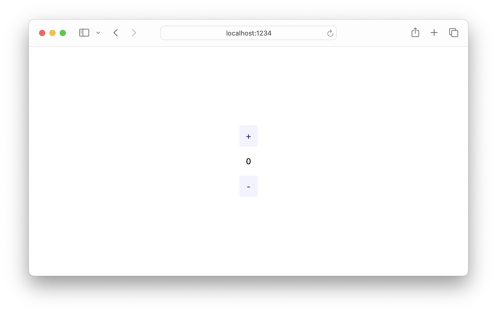

# 02 Interactivity

In this example we show the basic structure of all Lustre applications with a
classic counter example.

## The Model-View-Update architecture

All Lustre applications are built around the Model-View-Update (MVU) architecture.
This is a pattern that's been popularised by the Elm programming language and
has since been adopted by many other frameworks and languages.

MVU applications are built around three main concepts:

- A `Model` and a function to initialise it.
- A `Msg` type and a function to update the model based on messages.
- A `View` function to render the model as a Lustre `Element`.

These three pieces come together to form a self-contained update loop. You produce
an initial model, render it as HTML, and convert any user interactions into
messages to handle in the update function.

```text
                                       +--------+
                                       |        |
                                       | update |
                                       |        |
                                       +--------+
                                         ^    |
                                         |    |
                                     Msg |    | Model
                                         |    |
                                         |    v
+------+                         +------------------------+
|      |          Model          |                        |
| init |------------------------>|     Lustre Runtime     |
|      |                         |                        |
+------+                         +------------------------+
                                         ^    |
                                         |    |
                                     Msg |    | Model
                                         |    |
                                         |    v
                                       +--------+
                                       |        |
                                       |  view  |
                                       |        |
                                       +--------+
```

### Model

The model represents the entire state of your application. For most Lustre
applications this will be a record, but for this example we're aliasing `Int` to
our `Model` type to keep things simple.

We also need to write an `init` function that returns the initial state of our
application. It takes one argument, known as "flags" which is provided when the
application is first started.

```gleam
fn init(initial_count: Int) -> Model {
  case initial_count < 0 {
    True -> 0
    False -> initial_count
  }
}
```

Our `init` function takes a starting count, but ensures it cannot be below `0`.

### Update

In many other frameworks, it's common to update state directly in an event handler.
MVU applications take a different approach: instead of state updates being scattered
around your codebase, they are handled in a single `update` function.

To achieve this, we define a `Msg` type that represents all the different kinds of
messages our application can receive. If you're familiar with Erlang this approach
to state management will be familiar to you. If you're coming from a JavaScript
background, this approach is most-similar to state management solutions like Redux
or Vuex.

```gleam
pub opaque type Msg {
  Incr
  Decr
}
```

This approach means it is easy to quickly get an idea of all the ways your app
can change state, and makes it easy to add new state changes over time. By pattern
matching on an incoming message in our `update` function, we can lean on Gleam's
_exhaustiveness checking_ to ensure we handle all possible messages.

### View

Because state management is handled in our `update` function, our `view` becomes
a simple function that takes a model and returns some HTML in the form of a
Lustre `Element`.

```gleam
fn view(model: Model) -> Element(Msg) {
  ...
}
```

In Lustre we call _all_ functions that return an `Element` "view functions": there's
nothing special about the `view` that takes your model.

Folks coming from frameworks like React might notice the absence of components
with local encapsulated state. Lustre _does_ have components like this, but unlike
other frameworks these are a fairly advanced use of the library and are typically
used for larger pieces of UI like an entire form or a table. We'll cover how
components fit into Lustre in later examples, but for now resist the urge to think
in terms of "components" and "state" and try to think of your UI as a composition
of _view functions_.

## Creating a dynamic Lustre application

In the previous example we used the `lustre.element` function to construct a
static Lustre app. To construct a simple interactive app we can use `lustre.simple`
instead. From now on we'll see that all the different ways to construct a Lustre
application all take the same three `init`, `update`, and `view` functions.
